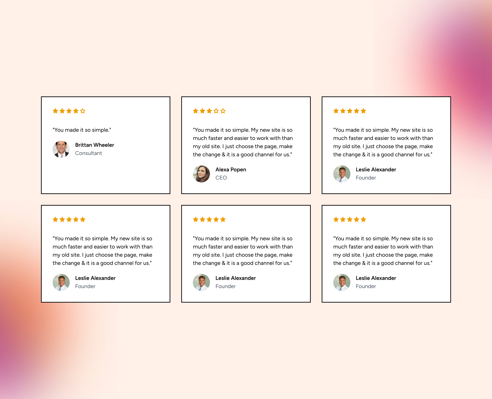
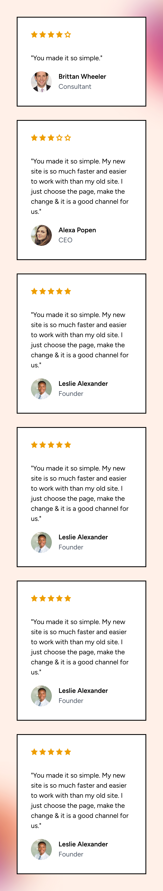

# Aire Labs Technical Assessment Solution
This is [@hendurhance](https://github.com/hendurhance) solution to the Aire Labs Technical Assessment. I used Laravel 10 and Livewire to complete the assessment. I used the [Tailwind CSS](https://tailwindcss.com/) framework for styling. I also wrote additional styles in the `public/css/app.css` file. 

## Installation
1. Clone the repository
```bash
git clone https://github.com/hendurhance/hendurhance-aire-labs-laravel-technical.git
```
2. Go to the project directory
```bash
cd hendurhance-aire-labs-laravel-technical
```
Note: If your directory is named differently, replace `hendurhance-aire-labs-laravel-technical` with the name of your directory.
3. Install Composer, Add Environment Variables, and Generate an Application Key using start.sh
```bash
scripts/start.sh
```
Note: If the script does not work give it executable permissions and try again.
```bash
chmod +x scripts/start.sh
```
4. Open the project in your browser using the URL provided on the command line. The default URL is `http://localhost:8000`.
5. Run the tests using the following command:
```bash
vendor/bin/phpunit
```

## Screenshots
### Desktop

### Mobile


## Notes
* I used the [Tailwind CSS](https://tailwindcss.com/) framework for styling. I also wrote additional styles in the `public/css/app.css` file.
* I used the [Livewire](https://laravel-livewire.com/) package to create the components and handle the form submission.
* I created a `resources/views/livewire/testimonial-component.blade.php` file to display the testimonial component. It also contains the data for the testimonials. It is a simple array of objects with the following structure:
```php
[
    [
        'name' => 'Brittan Wheeler',
        'designation' => 'Consultant',
        'image' => asset('images/Brittan_Wheeler.png'),
        'description' => 'You made it so simple.',
        'rating' => 4,
    ],
    ...
]
```
* I created a `resources/views/livewire/rating-component.blade.php` file to display the rating component. It accepts a rating value and displays the appropriate number of stars.


# Laravel Technical Assessment

Welcome to the Aire Labs technical interview! We were very impressed by your application, and wanted to invite you to complete a short technical assessment to make sure you would be a good fit for this role.

## Instructions

This repository has boilerplate code for a Laravel project, as well as some graphics assets. 

Clone this repository and name it "[your github username]-aire-labs-laravel-technical]". Then, using Livewire, please implement [this design](https://www.figma.com/file/n9fw5W1l4S7FyyV7qadnW2/Technical-Assessment?type=design&node-id=0%3A1&mode=design&t=YjDVnlWZmevfQ8JU-1).

When you are finished, email us the link to your repo with the subject "[Your Name] Aire Labs React Technical Assessment Completed".

## Grading

We are grading based on:

* [ ] Code structure
* [ ] Accuracy to the Figma
* [ ] Responsiveness
